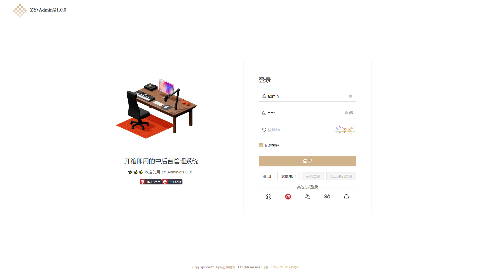
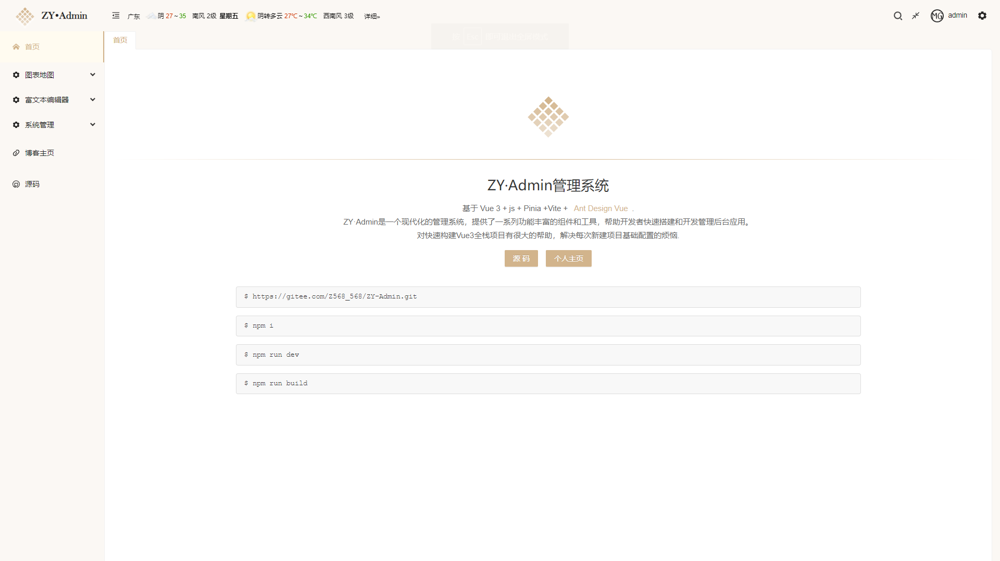

# Vue3-Antd-Plus 

<p align="center">
  <a href="https://gitee.com/Z568_568/mango-blog-system.git">
    
  </a>

<h3 align="center">" 🔥 Vue3-Antd-Plus "</h3>
  <p align="center">
    基于 Vue3 + JavaScript 现代化的管理系统【完整版】
    <br />
    <a href="https://gitee.com/Z568_568/vue3-antd-plus.git" target="_blank"><strong>探索本项目的Gitee源码 »</strong></a>
<br />
    <a href="https://z568_568.gitee.io/zy-admin-template" target="_blank"><strong>⛳ 在线预览Demo »</strong></a>
<br />
<a href="https://z568_568.gitee.io/vue3-antd-plus" target="_blank"><strong>教程文档 (更新中)»</strong></a>
    <br />
</p>
</p>


[Vue3-Antd-Plus](https://gitee.com/Z568_568/vue3-antd-plus.git)是一个现代化的前后端分离管理系统，旨在为开发者提供一套含有基础功能的组件和工具，以加速管理后台应用的开发过程。该项目经过二次封装组件、提供实用的工具、自定义的钩子函数、支持动态菜单和权限校验，甚至实现了按钮级别的权限控制等功能。

此项目采用了前端领域最新的技术栈，包括但不限于 **Vue 3、Vite、Pinia、Node.js、Antd** 等。因此，它不仅可以作为一个出色的项目启动模板，帮助你快速构建企业级中后台产品原型，还可以作为学习 Vue 3、Vite、JavaScript、Pinia、Node.js、MongoDB 等主流技术的示例项目。

这个项目致力于跟进前端技术的最新进展，将最新的技术应用于项目中。 因此，它不仅可以用于实际应用的开发，还可以作为学习和实验的理想资源，帮助你不断掌握前端领域的最新知识和技术。

无论你是一个开发者寻找一个可靠的管理后台模板，还是一个学习者想要深入了解现代前端技术，Vue3-Antd-Plus 都是一个非常有价值的项目。
**因为它弥补了不习惯使用TypeScript开发的同学，使用JavaScript版本就能更快上手熟悉**。


|名称|类型|
|-|-|
|ADMIN|管理端|
|CLIENT|前台端|
|SERVER|服务端|
|ADMIN-Template|管理端(纯前端模板)|

---


## 截图(管理后台+web前台) QQ群：529675917





### 功能：

*   [x] 前台端- 整体框架已搭建好
*   [x] 前台端- 接口已经接入
*   [x] 前台端- axios全局统一错误处理
*   [x] 管理端- 大屏数据可视化
*   [x] 管理端- 集成各类富文本编辑器
*   [x] 管理端- 自定义主题、菜单权限、按钮权限
*   [x] 管理端- 登录、注册、菜单、tabs顶栏菜单、全局搜索菜单
*   [x] 管理端- 用户管理、角色管理、权限管理、自定义指令权限判断
*   [x] 管理端- 用户操作日志项目代码生成器（前后端代码文件）、图标选择器
*   [x] 管理端- 错误统一处理
*   [x] 管理端- 表格导入、导出、下载
*   [x] 管理端- 图片文件音频上传、下载、预览...
*   [x] 服务端- 项目结构清晰
*   [x] 服务端- 集成邮件发送、定时器任务、统一响应数据格式
*   [x] 服务端- JWT验证、接口数据权限验证、角色权限验证
*   [x] 服务端- express-validator统一的参数验证
*   [x] 服务端- 接口日志记录、表格解析等等...


## 功能特性

- 使用 Vue 3 和 Vite 构建，具备高效的开发体验和优秀的性能表现
- 集成了 Ant Design Vue 组件库，提供美观的 UI 界面和丰富的组件选项 和主题切换
- 使用 Vue Router 实现路由管理，支持多层级路由和动态路由
- 使用 Axios 处理 HTTP 请求，与后端进行数据交互
- 集成 ECharts 图表库，展示数据统计和可视化效果
- 使用 Pinia 进行状态管理，提供了一种响应式的数据流方案
- 集成 Tinymce 富文本编辑器和 Vditor Markdown 编辑器，满足不同的编辑需求
- 使用 hotkeys-js 提供快捷键支持，增强用户操作体验
- 使用 Lodash 提供常用工具函数，简化开发流程
- 集成了测试工具集 @vue/test-utils 和 vitest，方便进行单元测试
- 更多....

#### 我的其他开源项目

> [Vue3-Antd-Admin-template管理端简洁版（纯前端）](https://gitee.com/Z568_568/ZY-Admin-template.git)

> [👆vue3个人主页简历个人博客前后端分离系统](https://gitee.com/Z568_568/ZHOUYI-Homepage.git)

>[😜vue2博客全栈系统 vue2 + node.js](https://gitee.com/Z568_568/all-blog-sys.git)
 
>[个人文件管理+图床管理服务系统](https://gitee.com/Z568_568/zy.files.sys.git)
 
>[node+mysql后端api基础服务模板](https://gitee.com/Z568_568/zy-express-sequelize-mysql)

>[node+mongodb开发REST API 的轻量级样板](https://gitee.com/Z568_568/node.mongodb)


## 快速开始


默认你的电脑已经安装好`Nodejs` `Vue` `MongoDB` 以及代码编辑器等环境

管理端启动成功后账号密码：admin  admin

我的环境配置可参考：

``` shell
Nodejs : v14.18.1
@vue/cli : v5.0.8
"express": "~4.16.1"
MongoDB: v6.0.5
```


1. 克隆本仓库到本地

   ```
   https://gitee.com/Z568_568/vue3-antd-plus.git
   ```

2. admin/client/server安装依赖

   ```
   npm install
   ```

3. admin/client/server本地启动

   ```
   npm run dev
   ```

4. 打包生产环境

   ```
   npm run build
   ```
## admin添加路由页面

```

启动成功后超级管理员账号密码： **账号：admin  密码：admin** 

/**
 * 在主框架内显示
 * 路由配置说明
 * {
      path: '/dir-demo-info',    // 页面地址（唯一）
      name: 'dir-demo-info',     // 页面名称（唯一）
      hidden: false,              // 隐藏（不展示在侧边栏菜单）
      meta: {
          title: '用户管理',       // 页面标题
          icon: 'yonghuguanli',  // 页面图标
          cache: true,          // 页面是否进行缓存 默认true
          link: false,           // 页面是否是外链 默认false
          frameSrc: false,       // 页面是否是内嵌 默认false
          requiresAuth: true,   // 页面是否是需要登录 默认true
          perms: [               // 页面的操作的权限列表
              'sys:user:list',   // 查询
              'sys:user:create', // 增加
              'sys:user:update', // 更新
              'sys:user:delete', // 删除
          ],
      },
      component: () => import('@/views/sys/user/dir-user-info.vue'),
   }
 *
 */
```
 
....


## 贡献

欢迎对Vue3-Antd-Plus项目的改进和完善，如果您发现任何错误或有任何建议，请随时提交问题和拉取请求。

## 版权

Vue3-Antd-Plus是一个开源项目，根据MIT许可证发布。有关更多信息，请参阅LICENSE文件。

## 联系方式

如果你有任何问题或建议，请通过以下方式联系我：

- 邮箱：yizhou568@gmail.com

